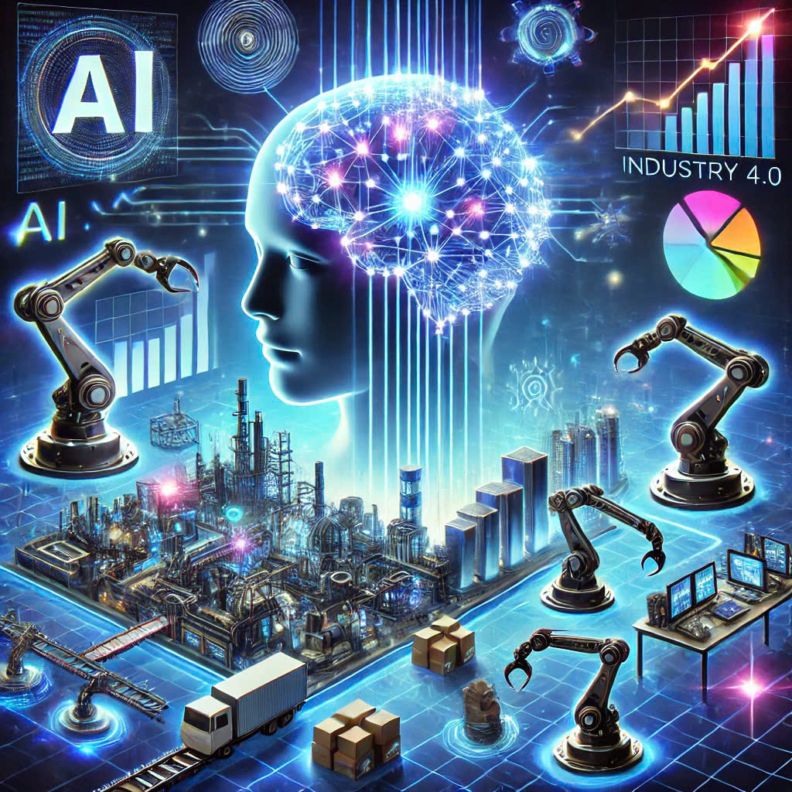
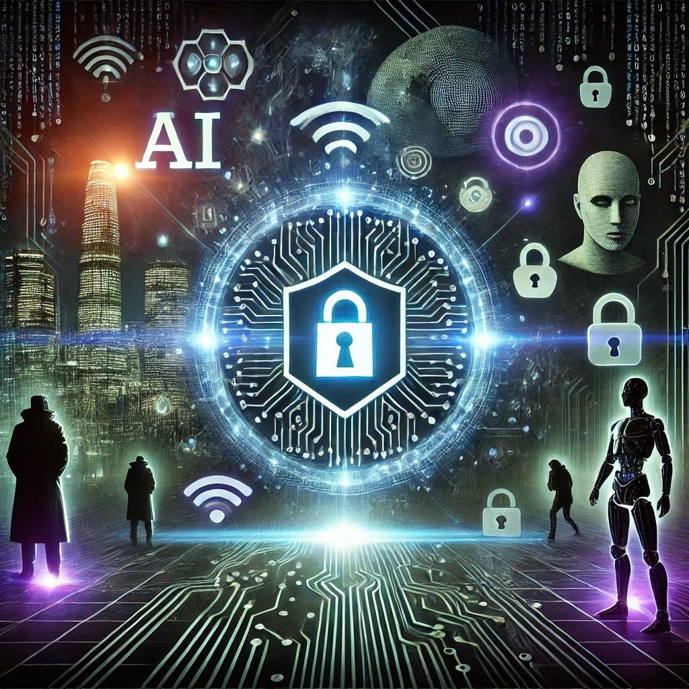
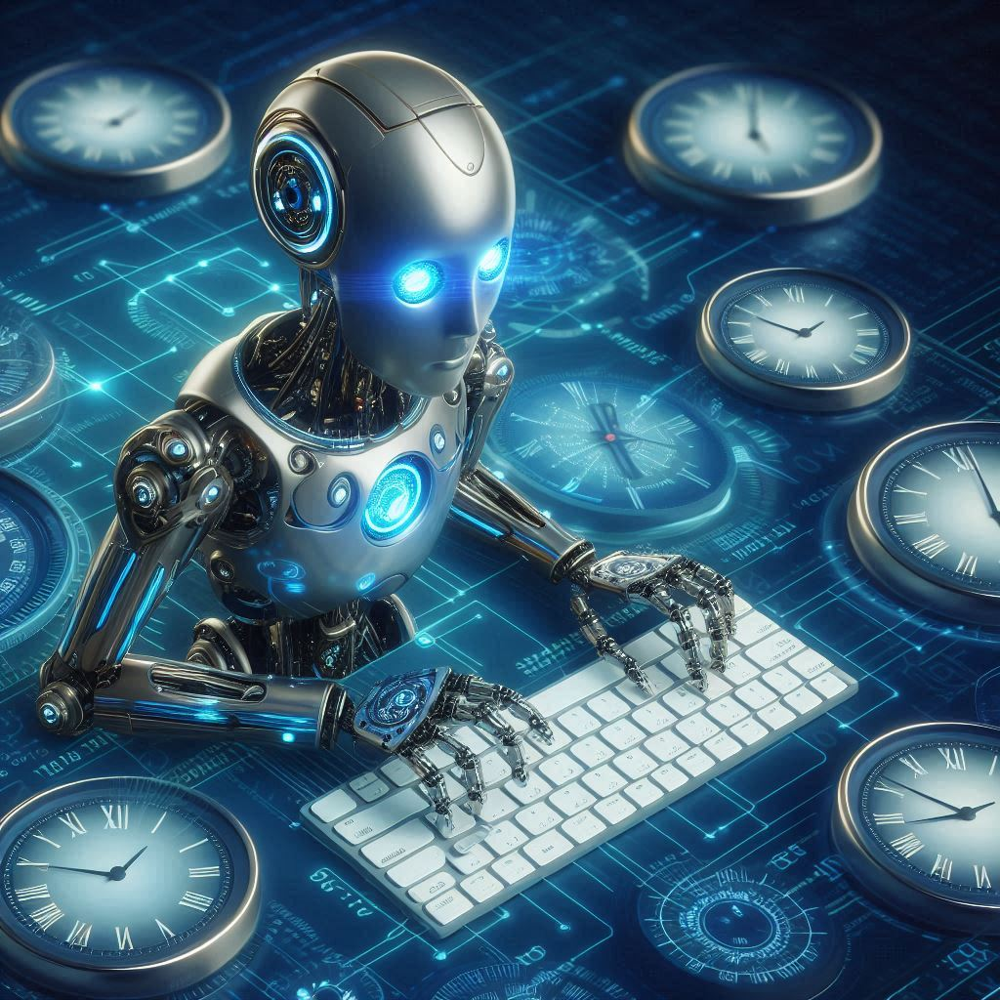

# Nguyen_L_Le_D_Midterm

Advantages and Disadvantages of AI Technology

# ADVANTAGES OF AI TECHNOLOGY

**AI offers numerous advantages that significantly enhance our daily lives and various fields, from automating business processes to improving customer experiences. With its ability to analyze vast amounts of data, AI not only saves time and resources but also opens up new opportunities in research, healthcare, and technology. The advancement of AI is gradually transforming how we interact with the world, creating smarter and more efficient solutions to complex problems.**

## Improve Healthcare Services

AI can analyze medical data and provide more accurate diagnoses, helping doctors detect diseases early. AI applications in healthcare also personalize treatment methods, thereby improving patient health.

## Support Education And Research

AI can help students learn more effectively by personalizing study content, automating grading, and providing tailored learning suggestions. In scientific research, AI assists in rapidly analyzing and processing large datasets, thereby accelerating the speed and quality of inventions and innovations.

## Promote The Economy And Industry 4.0

AI is one of the key pillars of the Fourth Industrial Revolution, helping businesses grow through market data analysis, predicting consumer behavior, and creating new products tailored to customer needs.

## Cybersecurity And Crime Prevention

AI can quickly detect and respond to cyberattacks, ensuring security for individuals and businesses. Additionally, AI systems in law enforcement help monitor, detect, and prevent crime through the analysis of visual data and behavior patterns.

## 24/7 Availability

AI’s 24/7 availability provides continuous support, ensuring immediate responses, scalability, consistent quality, cost efficiency, and enhanced customer satisfaction.

# DISADVANTAGES OF AI TECHNOLOGY

**While AI offers numerous transformative benefits, it also presents significant challenges that warrant careful consideration. The rapid advancement of AI technology can result in job displacement through automation, as well as privacy concerns due to the vast collection and use of personal data without adequate regulation. Additionally, AI introduces security and ethical risks, particularly as society becomes increasingly reliant on these systems without fully understanding their inner workings. The high development and maintenance costs associated with AI further exacerbate these challenges, requiring substantial financial and technical resources. Moreover, overreliance on AI may erode human critical thinking and decision-making abilities. As such, it is imperative to implement robust management and oversight frameworks to mitigate these potential drawbacks and ensure that AI serves the broader good responsibly.**

## Job Losses

As AI and robots automate tasks like manufacturing, customer service, and even more complex roles, many people will lose their jobs. For example, factories may no longer need human workers because AI can take over the entire process.

## Privacy Threats

AI has the ability to collect and process large amounts of personal data. This can lead to privacy violations, as personal information, browsing history, or internet usage habits may be tracked and misused. For instance, AI could analyze your online behavior and create a personal profile without your knowledge.

## Hard to Control and Lack of Transparency

AI systems are complex, and it can be challenging to understand how they make decisions. This creates major issues with transparency and control. If AI makes an important decision, like denying a loan request or making a legal judgment, humans may struggle to understand its reasoning.

## High Development and Maintenance Costs

Developing and maintaining AI systems require significant resources, including highly skilled professionals and powerful hardware. This can increase costs for businesses and society.

## Overdependence on AI

Humans may increasingly rely on AI to solve every problem, leading to a loss of independent thinking. When people stop making decisions on their own and merely follow AI's suggestions, they may lose creativity or critical thinking skills.~
